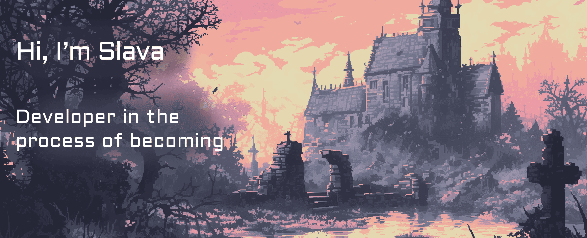

<html lang="en">  
<head>  
    <meta charset="UTF-8">  
    <meta name="viewport" content="width=device-width, initial-scale=1.0">
<!--     <link rel="stylesheet" href="./assets/styles.css">   -->
</head>  
<body>

<h2 align="center">
	My Github Stats
</h2>
 

	

<!--        -->
<!--        -->

  
</body>  
</html>

<!--

-->
